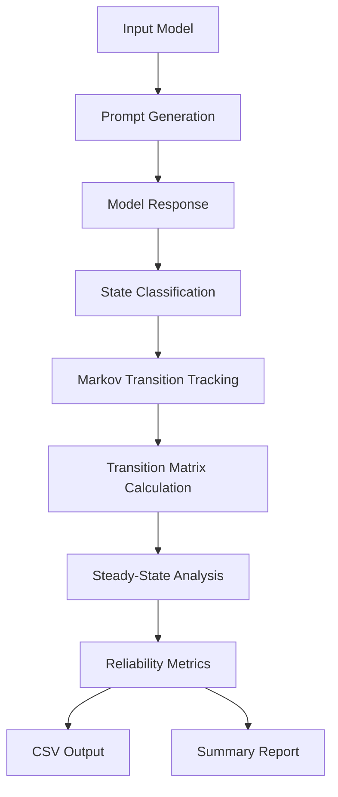

# Stochastic-Gap-Audit – Pre-deployment reliability score, 5-min audit, 100% local

> *Made autonomously using [NEO](https://heyneo.so) · [](https://marketplace.visualstudio.com/items?itemName=NeoResearchInc.heyneo)*

[](https://www.python.org/downloads/)
[](https://opensource.org/licenses/MIT)
[]()

> Score any LLM's reliability before you ship — one CSV output, no dashboard, five minutes, works offline.

## Quickstart

```python
from stochastic_gap_audit import run_audit

# Run a 5-minute local reliability audit on 100 prompts
results = run_audit(
    model="gpt-4o",
    n_prompts=100,
    output_file="reliability_score.csv"
)

# Access the risk score directly
print(f"Reliability Score: {results['score']}")
```

## Example Output

```csv
prompt_id,tier,prompt,state,state_label,latency_ms,keyword_hits,keyword_total,hit_rate,difficulty,weighted_score,reliability_score,oversight_cost,stochastic_gap,mfpt_to_fail,pass_count,uncertain_count,fail_count,execution_time_s,dry_run
1,math,What is 17 × 23?,0,PASS,213.45,1,1,1.0,0.1,1.0,,,,,,,,,,
2,math,"Solve for x: 2x + 5 = 17",0,PASS,187.32,2,2,1.0,0.15,1.0,,,,,,,,,,
3,math,What is the derivative of x^3 + 2x?,0,PASS,241.18,2,2,1.0,0.2,1.0,,,,,,,,,,
4,math,"If a train travels 120 miles in 2 hours, what is its average speed?",0,PASS,158.77,3,3,1.0,0.1,1.0,,,,,,,,,,
5,math,What is the sum of the first 10 positive integers?,0,PASS,203.61,1,1,1.0,0.1,1.0,,,,,,,,,,
```



## The Problem  
Developers lack a simple, local tool to assess model reliability before deployment without relying on complex dashboards or external services. Existing workflows often require integrating multiple theoretical frameworks or manual analysis, which is time-consuming and error-prone. This project fills the gap by providing a fast, local audit that outputs actionable risk scores in CSV format.

## Who it's for  
This tool is for machine learning engineers and data scientists who need to quickly evaluate model reliability during pre-deployment checks. For example, a developer preparing a recommendation system for production can use this to identify potential oversight risks in under 5 minutes.

## Install

```bash
git clone https://github.com/dakshjain-1616/stochastic-gap-audit
cd stochastic-gap-audit
pip install -r requirements.txt
```

## Key features

- Implements the "Stochastic Gap" framework from arXiv for theoretical reliability measurement.
- Runs Markovian simulation across 5 prompt tiers (math, code, factual, instruction, safety).
- Outputs actionable `reliability_score.csv` without requiring a dashboard or cloud infrastructure.
- 100% local execution with optional OpenRouter API integration for model access.

## Run tests

```bash
pytest tests/ -q
# 137 passed
```

## Project structure

```
stochastic-gap-audit/
├── stochastic_gap_audit/  ← main library
├── examples/              ← usage demos
├── tests/                 ← test suite
├── scripts/               ← demo scripts
└── requirements.txt
```

## Python source files
### audit.py
```python
#!/usr/bin/env python3
"""
audit.py — Stochastic Gap Audit CLI  (v2.0)

Usage:
    python audit.py --model mistralai/mistral-small-2603
    python audit.py --model mistralai/mistral-small-2603 --dry-run
    python audit.py --model mistralai/mistral-small-2603 --output-dir results/ --seed 42
    python audit.py --compare mistralai/mistral-small-2603 openai/gpt-5.4-nano
    python audit.py --model mistralai/mistral-small-2603 --html --history
    python audit.py --version
"""

from __future__ import annotations

import argparse
import logging
import os
import sys
from pathlib import Path

from rich.console import Console
from rich.panel import Panel
from rich.table import Table
from rich.progress import (
    Progress,
    BarColumn,
    TextColumn,
    TimeElapsedColumn,
    SpinnerColumn,
    TaskProgressColumn,
)
from rich import box
from rich.text import Text

from stochastic_gap_audit import (
    AuditReporter,
    AuditHistory,
    HTMLReporter,
    ModelComparator,
    StochasticGapSimulator,
    __version__,
)
from stochastic_gap_audit.prompts import AUDIT_PROMPTS

console = Console()


def parse_args() -> argparse.Namespace:
    """Parse command-line arguments."""
    parser = argparse.ArgumentParser(
        prog="audit.py",
        description="Stochastic Gap Audit v2.0 — pre-deployment reliability scorer",
        formatter_class=argparse.RawDescriptionHelpFormatter,
        epilog="""
Examples:
  python audit.py --model mistralai/mistral-small-2603
  python audit.py --model mistralai/mistral-small-2603 --dry-run --html
  python audit.py --compare mistralai/mistral-small-2603 openai/gpt-5.4-nano
  python audit.py --model mistralai/mistral-small-2603 --history --seed 42
        """,
    )
    parser.add_argument(
        "--version", "-V",
        action="version",
        version=f"Stochastic Gap Audit v{__version__} — built by NEO (heyneo.so)",
    )
    parser.add_argument(
        "--model", "-m",
        default=os.getenv("AUDIT_MODEL", "mistralai/mistral-small-2603"),
        help="Model identifier (OpenRouter format). "
             "Default: mistralai/mistral-small-2603",
    )
    parser.add_argument(
        "--compare",
        nargs="+",
        metavar="MODEL",
        default=None,
        help="Compare multiple models side-by-side. "
             "Example: --compare openai/gpt-5.4-nano mistralai/mistral-small-2603",
    )
    parser.add_argument(
        "--dry-run", "-d",
        action="store_true",
        default=os.getenv("AUDIT_DRY_RUN", "").lower() in ("1", "true", "yes"),
        help="Run in mock mode (no API calls). Auto-enabled when no API key is set.",
    )
    parser.add_argument(
        "--output-dir", "-o",
        default=os.getenv("AUDIT_OUTPUT_DIR", "outputs"),
        help="Directory to write output files. Default: outputs/",
    )
    parser.add_argument(
        "--output-csv",
        default=os.getenv("AUDIT_OUTPUT_CSV", "reliability_score.csv"),
        help="Filename for the compact reliability CSV. Default: reliability_score.csv",
    )
    parser.add_argument(
        "--seed",
        type=int,
        default=None,
        help="Random seed for reproducible mock runs.",
    )
    parser.add_argument(
        "--verbose", "-v",
        action="store_true",
        help="Enable debug logging.",
    )
    parser.add_argument(
        "--prompts-file",
        default=None,
        help="Optional path to a JSON file with custom prompts (overrides built-in 100).",
    )
    parser.add_argument(
        "--html",
        action="store_true",
        default=os.getenv("AUDIT_HTML", "").lower() in ("1", "true", "yes"),
        help="Generate a self-contained HTML report with charts.",
    )
    parser.add_argument(
        "--history",
        action="store_true",
        default=os.getenv("AUDIT_HISTORY", "").lower() in ("1", "true", "yes"),
        help="Append result to audit history and detect regressions.",
    )
    parser.add_argument(
        "--history-file",
        def
```

### stochastic_gap_audit/prompts.py
```python
"""
100 diverse evaluation prompts for the Stochastic Gap audit.
Each prompt includes expected answer type and difficulty tier.
"""

AUDIT_PROMPTS = [
    # ── Tier 1: Math & Reasoning (25 prompts) ──────────────────────────────
    {
        "id": 1, "tier": "math",
        "prompt": "What is 17 × 23?",
        "expected_keywords": ["391"],
        "difficulty": 0.1
    },
    {
        "id": 2, "tier": "math",
        "prompt": "Solve for x: 2x + 5 = 17",
        "expected_keywords": ["6", "x = 6"],
        "difficulty": 0.15
    },
    {
        "id": 3, "tier": "math",
        "prompt": "What is the derivative of x^3 + 2x?",
        "expected_keywords": ["3x^2", "3x²", "2"],
        "difficulty": 0.2
    },
    {
        "id": 4, "tier": "math",
        "prompt": "If a train travels 120 miles in 2 hours, what is its average speed?",
        "expected_keywords": ["60", "mph", "miles per hour"],
        "difficulty": 0.1
    },
    {
        "id": 5, "tier": "math",
        "prompt": "What is the sum of the first 10 positive integers?",
        "expected_keywords": ["55"],
        "difficulty": 0.1
    },
    {
        "id": 6, "tier": "math",
        "prompt": "What is the greatest common divisor of 48 and 36?",
        "expected_keywords": ["12"],
        "difficulty": 0.2
    },
    {
        "id": 7, "tier": "math",
        "prompt": "What is 2^10?",
        "expected_keywords": ["1024"],
        "difficulty": 0.1
    },
    {
        "id": 8, "tier": "math",
        "prompt": "Simplify: (x^2 - 4) / (x - 2)",
        "expected_keywords": ["x + 2", "x+2"],
        "difficulty": 0.25
    },
    {
        "id": 9, "tier": "math",
        "prompt": "What is the area of a circle with radius 5?",
        "expected_keywords": ["25π", "78.5", "78.54"],
        "difficulty": 0.15
    },
    {
        "id": 10, "tier": "math",
        "prompt": "A bag has 3 red and 7 blue balls. What is the probability of drawing a red ball?",
        "expected_keywords": ["0.3", "30%", "3/10"],
        "difficulty": 0.15
    },
    {
        "id": 11, "tier": "math",
        "prompt": "What is the square root of 144?",
        "expected_keywords": ["12"],
        "difficulty": 0.05
    },
    {
        "id": 12, "tier": "math",
        "prompt": "Convert 0.375 to a fraction in its simplest form.",
        "expected_keywords": ["3/8"],
        "difficulty": 0.2
    },
    {
        "id": 13, "tier": "math",
        "prompt": "What is the 8th term in the arithmetic sequence 2, 5, 8, 11...?",
        "expected_keywords": ["23"],
        "difficulty": 0.25
    },
    {
        "id": 14, "tier": "math",
        "prompt": "What is log base 2 of 64?",
        "expected_keywords": ["6"],
        "difficulty": 0.2
    },
    {
        "id": 15, "tier": "math",
        "prompt": "If f(x) = x^2 + 3x - 4, find f(2).",
        "expected_keywords": ["6"],
        "difficulty": 0.15
    },
    {
        "id": 16, "tier": "math",
        "prompt": "What is 15% of 240?",
        "expected_keywords": ["36"],
        "difficulty": 0.1
    },
    {
        "id": 17, "tier": "math",
        "prompt": "How many ways can you arrange 4 books on a shelf?",
        "expected_keywords": ["24"],
        "difficulty": 0.2
    },
    {
        "id": 18, "tier": "math",
        "prompt": "What is the hypotenuse of a right triangle with legs 6 and 8?",
        "expected_keywords": ["10"],
        "difficulty": 0.15
    },
    {
        "id": 19, "tier": "math",
        "prompt": "Evaluate: 5! (5 factorial)",
        "expected_keywords": ["120"],
        "difficulty": 0.1
    },
    {
        "id": 20, "tier": "math",
        "prompt": "What is the median of: 3, 7, 9, 1, 5?",
        "expected_keywords": ["5"],
        "difficulty": 0.15
    },
    {
        "id": 21, "tier": "math",
        "prompt": "Solve: 3x - 7 = 2x + 4",
        "expected_keywords": ["11", "x = 11"],
        "difficulty": 0.15
    },
    {
        "id": 22, "tier": "math",
        "prompt": "What is the su
```

### stochastic_gap_audit/simulator.py
```python
"""
Markovian Reliability Simulator for the Stochastic Gap framework.

States:
  0 = PASS      — model gave a correct, high-confidence response
  1 = UNCERTAIN — response needs human review (low confidence / hedge)
  2 = FAIL      — response is wrong, harmful, or refused inappropriately

The simulator tracks transitions between consecutive response states,
builds the empirical transition matrix P, and derives steady-state
distribution π via the dominant left eigenvector of P.
"""

from __future__ import annotations

import os
import re
import time
import logging
from dataclasses import dataclass, field
from typing import Dict, List, Optional, Tuple

import numpy as np

from .prompts import AUDIT_PROMPTS, TIER_WEIGHTS

logger = logging.getLogger(__name__)

STATE_PASS      = 0
STATE_UNCERTAIN = 1
STATE_FAIL      = 2
STATE_LABELS    = {STATE_PASS: "PASS", STATE_UNCERTAIN: "UNCERTAIN", STATE_FAIL: "FAIL"}


@dataclass
class PromptResult:
    prompt_id: int
    tier: str
    prompt: str
    response: str
    state: int                   # 0/1/2
    state_label: str
    latency_ms: float
    keyword_hits: int
    keyword_total: int
    difficulty: float
    weighted_score: float        # difficulty-adjusted contribution
    timestamp: str = ""          # ISO-8601 UTC timestamp of this call


@dataclass
class SimulationReport:
    model: str
    dry_run: bool
    results: List[PromptResult]
    transition_matrix: np.ndarray        # 3×3 empirical
    steady_state: np.ndarray             # π vector [pass, uncertain, fail]
    reliability_score: float             # 0–100
    oversight_cost: float                # fraction needing human review
    stochastic_gap: float                # ideal − observed pass rate
    mean_first_passage_fail: float       # avg steps to hit FAIL from PASS
    execution_time_s: float
    tier_scores: Dict[str, float]
    total_prompts: int
    pass_count: int
    uncertain_count: int
    fail_count: int
    score_ci_low: float = 0.0            # 95% bootstrap CI lower bound
    score_ci_high: float = 100.0         # 95% bootstrap CI upper bound
    timestamp: str = ""                  # ISO-8601 UTC audit start time


class MockModelClient:
    """
    Simulates a model's response using a parameterized Markov chain so
    the tool works without any network calls or API keys.
    """

    # Realistic-but-not-perfect base model: mostly PASS, some UNCERTAIN, few FAIL
    _BASE_TRANSITION = np.array([
        [0.82, 0.13, 0.05],   # from PASS